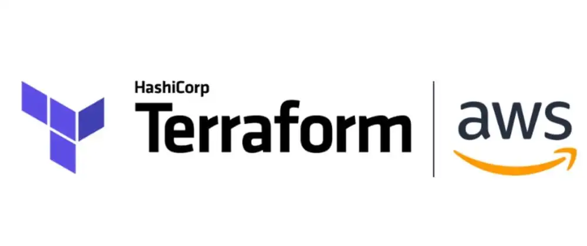

# TERRAFORM

Terraform is a declarative Infrastructure as Code, IaC tool. That is it a tool for provisioning resource on various providers such as AWS, Azure, GCP etc. Delarative in that you specify the end state of the resources and terraform will go ahead to generate an execution plan describing what it will do to reach the desired state, and then executes it to build the described infrastructure.

# Install Terraform
On macOS, simply run `brew install terraform`

# Prerequisites
To follow this tutorial you will need:
- An AWS account
- The AWS CLI installed
- Your AWS credentials are configured locally.

# Authentication with AWS
1. With your account created and the CLI installed to configure the AWS CLI run `aws configure`
2. Follow the prompts to input your AWS Access Key ID, Secret Access Key, default region ***us-east-1*** and default output format ***json***
3. The configuration process creates a file at ~/.aws/credentials on macOS and Linux or %UserProfile%\.aws\credentials on Windows, where your credentials are stored.

# Write Configuration file
This file refers to a .tf file where you will describe the infrastructure to be provisioned by terraform.
- cd into your desktop or wherever location you like to save your project. For me, it is my *Desktop*
- run `mkdir terraform-project`
- `cd terraform-project` to go into the created directory.
- run `touch main.tf` to create the file

## Providers
This refers to the cloud service provider. In our case, our provider is AWS which is responsible for creating and managing resources.
A provider is a plugin that Terraform uses to translate the API interactions with the service
- first define your provider copying and pasting this block.
```
terraform {
    required_providers {
        aws = {
        source = "hashicorp/aws"
        version = "4.48.0"        #version is optional, u can remove this line
        }
    }
    }
```
```
provider "aws" {
    profile = "default"   #if left out, terraform automatically searches for saved API credentials to use
    region = "us-east-1"
}
```
The **profile** attribute in the "provider" block refers to the AWS credentials stored in the AWS Config File, created when we configured the AWS CLI. It is recommended that you never hard-code credentials into *.tf configuration files. We are explicitly defining the default AWS config profile here to illustrate how Terraform should access sensitive credentials.

## Create Resource
The resource the block defines a piece of infrastructure. A resource might be a physical component such as an EC2 instance, or it can be a logical resource such as a Heroku application. Defining a resource follows this general pattern, *resource "provider_resource_name" "resource_name_given_by_you" { }. Lets define an ec2 resources*
```
    resource "aws_instance" "my-first-ec2-using-tf" {
    ami           = "ami-0574da719dca65348" #goto to the ec2 console, 'deploy inst', search for the ami u want e.g 'ubuntu' and copy
    instance_type = "t2.micro"

    tags = {                #tag is optional
        Name = "first-inst-with-tf"
        }
    }
```

## Initialize the directory
After creating a new configuration file or check out an existing configuration from version control — you need to initialize the directory with this command `terraform init`. This will download and installs providers used in the configuration, which in this case is the aws provider.


## Validate your configuration
- run `terraform validate`
If your configuration is valid, Terraform will return a success message.

## Create Infrastructure
- run `terraform plan` terraform will go ahead to compare your infrastructure definition and resources running on your aws account if any and will output what will be created or deleted.
- run `terraform apply` and type yes when prompted. This will go ahead and provision the ec2 instance we have defined.
