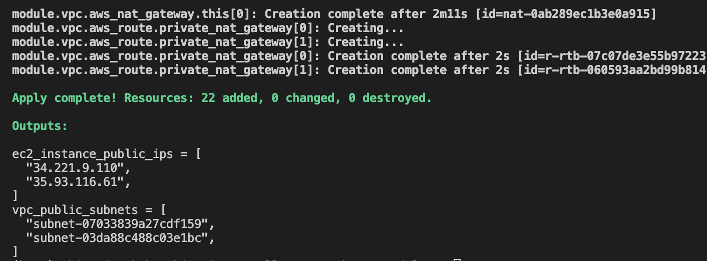

# TERRAFORM MODULES

A collection of .tf or .tf.json files kept together in a directory is known as module. It is a container for multiple resourses used together. In this project we will work with terraform modules. A module block has *source* attribute which is a required attr that tells terraform where to download the module from. A *version* attr. tells the version of the module to use.

# Using Registry Modules in Configuration
This are modules built and made available on terraform registry for use by anyone. It is like packages in programming languages.
The configuration configuration in this directory will use modules to create a Virtual Private Cloud (VPC) and two EC2 instances in an aws environment.
visit [Terraform Registry page for the VPC module](https://registry.terraform.io/modules/terraform-aws-modules/vpc/aws/3.14.0).
The page provides information about the module and a link to the source repository. 

# Create Configuration
- create a folder named *modules* and cd into the directory
- create **terraform.tf** and copy the `terraform` block into it.
- create a **main.tf** file and copy the code into it
    - The provider "aws" block configures the AWS provider.
    - The module "vpc" block configures a Virtual Private Cloud (VPC) module, which provisions networking resources such as a VPC, subnets, and internet and NAT gateways based on the arguments provided.
    - The module "ec2_instances" block defines EC2 instances to be provisioned within the VPC created by the module.
    - In the *ec2_instances* block, notice that a ***meta argument***, *count* is used to define the number ec2 instances to be provisioned.

# Set values for module input variables
As a module can contain both required and optional arguments, all required arguements which usually corresponds to module's inpute variables must be specified to use the module.
A pattern of identifying which module arguments you may want to change in the future, and then to create matching variables in your configuration's ***variables.tf*** file with sensible default values.
- create a *variables.tf* file to define the inpute variables we have referenced.
- copy the code from the *variables.tf* file and paste

# Create output variable
Modules also have output variables that can be referenced using the following *module.MODULE_NAME.OUTPUT_NAME* naming convention.
Visit [module output variables](https://registry.terraform.io/modules/terraform-aws-modules/vpc/aws/3.14.0?tab=outputs) to learn more.
- create a file named *outputs.tf*
- copy the code and paste
- In the *outputs* definition, the *vpc_public_subnets* output references the *vpc* module's *public_subnets* output, and *ec2_instance_public_ips* references the public IP addresses for both EC2 instances created by the module.

# Provision infrastructure
- run `terraform init` from the *modules* directory to initialize the configuration.

- run *terraform apply* and enter *yes* when prompted.
- Once Terraform completes, it will display the configuration outputs.

# Delete your infrastructure
- run `terraform destroy` an enter *yes* at the prompt
